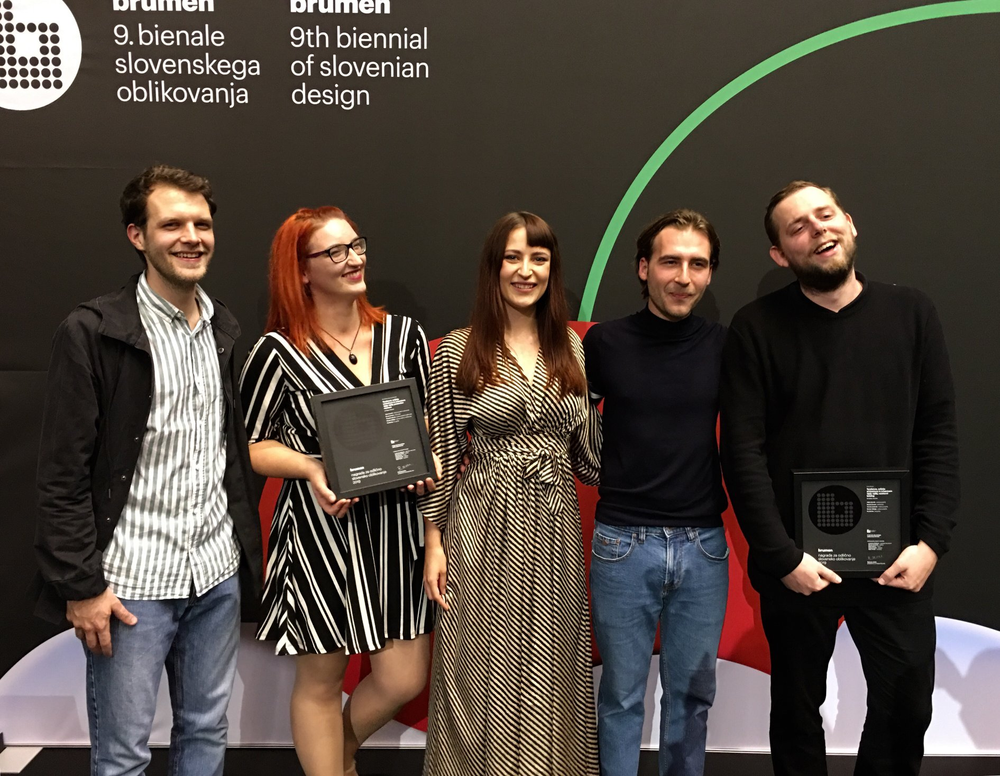

# Projekt "Tendence": Plečnikova medalja in Brumenova nagrada

Z izjemnim ponosom se spominjam leta 2019, ko je naš obsežen raziskovalni projekt **"Tendence, celjska arhitektura in urbanizem 1955–1985"** prejel dve pomembni strokovni nagradi: **Plečnikovo medaljo** in **Brumenovo nagrado**.

Skupaj s kolegi – Adamom Breznikom, Timotejem Jevšenakom, Moniko Vešligaj in Domnom Ermencem – smo se lotili sistematičnega evidentiranja, dokumentiranja in vrednotenja pogosto spregledane povojne arhitekturne dediščine v Celju.

Naš trud je bil najprej prepoznan s **Plečnikovo medaljo za izjemen prispevek k bogatitvi arhitekturne kulture**. Strokovna žirija je v utemeljitvi poudarila pomen in kakovost celotnega projekta:
> *Skupina za projektom TendenCe je prepoznala probleme in kakovosti, samoiniciativno začrtala cilje projekta in ga izpeljala z odliko. Žirija ji za doprinos k arhitekturni kulturi podeljuje Plečnikovo medaljo.*

Poleg tega je bil naš trud prepoznan tudi na **11. bienalu slovenskega oblikovanja Brumen**, kjer je **razstavni katalog** projekta prejel **Brumenovo nagrado**. V projektu sem sodelovala kot **avtorica fotografij**, ki so ključen del vizualne podobe nagrajenega kataloga. Žirija je v svoji utemeljitvi zapisala:
> *Dobro strukturiran katalog, ki uporablja presenetljivo naslovno črkovno vrsto in se jasno navezuje na jugoslovanski modernizem, ne da bi bil zato zastarel ali kolažiran. Odlična podporna publikacija za razstavo, ki jo spremlja.*

Prejetje teh dveh prestižnih nagrad zame ne predstavlja le potrditve našega truda in strokovnega dela, temveč tudi spodbudo za nadaljnje raziskovanje in ohranjanje bogate slovenske arhitekturne zgodovine.

---
#### **Viri in reference:**

* **[Brumenova nagrada (11. bienale slovenskega oblikovanja)](https://brumen.awardsplatform.com/gallery/awezbbve/BoABZDrw?search=8218c74d14063637-6)**

* **[Uradna utemeljitev Plečnikovih odličij 2019](https://www.plecnikovenagrade.si/plecnikova_odlicja/tendence-celjska-arhitektura-in-urbanizem-19551985)**

* **[Poročilo o podelitvi, Odprte hiše Slovenije](https://odprtehiseslovenije.org/plecnikova-nagrada-2019-zrcalo-domaci-arhitekturni-produkciji/)**

* **[Katalog Plečnikovih nagrad 2019 (PDF), Društvo arhitektov Ljubljana](https://drustvo-dal.si/pdf/Ple.knjizica.19splet_4.pdf)**

* **[Objava o nagradi, Društvo arhitektov Ljubljana](https://drustvo-dal.si/index.php?nav=200&sel_id=2755&jezik=SL&row=104)**

* **[Napoved razstave, Zbornica za arhitekturo in prostor Slovenije (ZAPS)](https://zaps.si/dogodek/razstava-tendence-celjska-arhitektura-in-urbanizem-1955-1985/)**

* **[Zapis o projektu, Arhiv Fakultete za arhitekturo Univerze v Ljubljani](https://depo.fa.uni-lj.si/izdelek/A113)**

* **[Bibliografski podatki o katalogu, Google Books](https://books.google.si/books/about/Tendence.html?id=5HlEwAEACAAJ&redir_esc=y)**

* **[COBISS zapis o publikaciji](https://plus.cobiss.net/cobiss/si/sl/bib/sikce-1/299242752)**

* **[Podelitev Brumnovih Nagrad](https://www.facebook.com/photo.php?fbid=2326221414356575&id=2050334845278568&set=a.2054611238184262)
